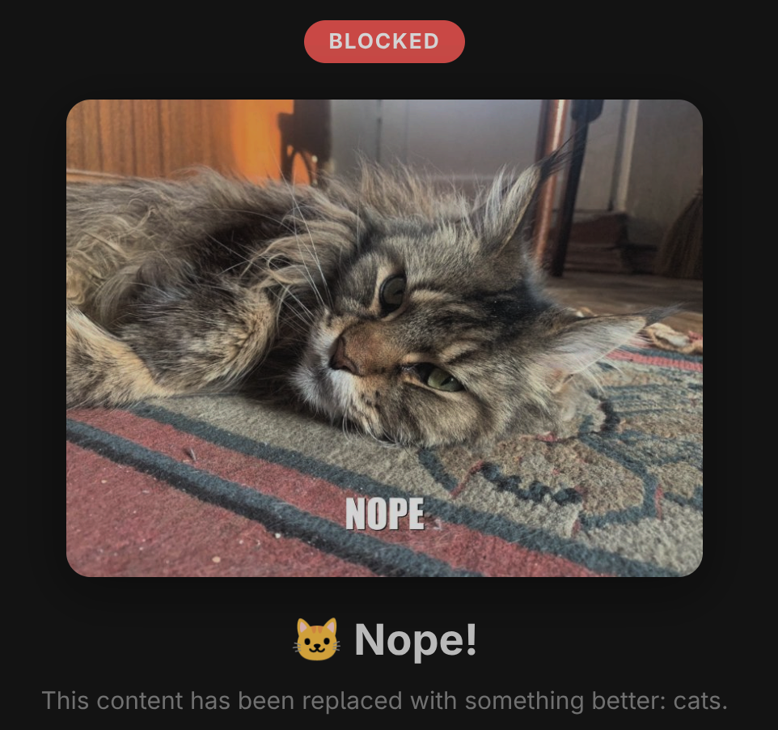

# YouNope

YouNope is a Manifest V3 Chrome extension for blocking YouTube channels.

It can:

- block a channel from the extension popup
- add a block button on supported YouTube pages
- hide videos from blocked channels in feeds and recommendations
- replace blocked channel pages with a cat page
- import a blocklist from text, CSV, or JSON

## Screenshot



## Install locally

1. Open `chrome://extensions`.
2. Enable Developer mode.
3. Click Load unpacked.
4. Select this directory: `younope/`.

## Files

- `manifest.json`: Chrome extension manifest
- `content.js`: YouTube page integration
- `popup.html` and `popup.js`: popup UI
- `options.html` and `options.js`: import/settings UI
- `example.txt`: sample blocklist

## Development checks

From the repository root:

```bash
node --check younope/content.js
node --check younope/popup.js
node --check younope/options.js
python3 -m json.tool younope/manifest.json >/dev/null
```

## License

GPLv3 via the root repository `LICENSE`.
